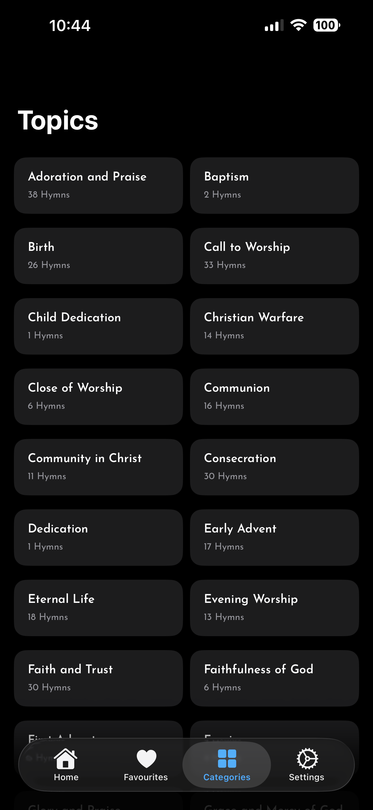
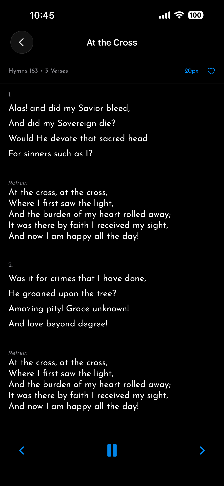

# 📖 Resonate

**Resonate** is a modern Seventh-day Adventist hymnal app built with SwiftUI.

It provides structured hymn browsing, intelligent search, reader customization, and limited bundled audio playback — designed with clean architecture and future scalability in mind.

---

## 🏷 Badges


---

## ✨ Features

### 🎵 Hymn Library
- Browse hymns by category
- View hymn details with structured verses and chorus
- Recently viewed hymns
- Favourite hymns with persistent storage

### 🔎 Intelligent Search
- Search by hymn number (exact and partial)
- Search by title
- Search by lyrics (verse-level matching)
- Numeric quick jump behavior
- Debounced search for performance

### 📖 Reader Experience
- Adjustable font size
- Adjustable font family
- Line spacing control
- Toggle verse numbers
- Rename “Chorus” / “Refrain”
- Clean immersive reading layout

### 🔊 Audio (Limited v1)
- Bundled audio for selected hymns
- Deterministic audio badge indicator
- AVAudioPlayer-based playback
- Haptic feedback integration
- Automatic stop on navigation

### 🎨 UI & Visual Design
- Procedurally generated gradient card backgrounds
- Deterministic color system
- Adaptive dark mode support
- Responsive grid layouts
- Clean SwiftUI navigation

### ⚙️ Settings
- Reader preferences
- Haptics toggle
- Library management
- Audio controls
- About & Credits section

---

## 🖼 Screenshots

```markdown






```

---

## 🏗 Architecture

Resonate follows a layered, modular architecture:

```
AppEnvironment
 ├── HymnService
 ├── TuneService
 ├── AudioPlaybackService
 ├── RecentlyViewedService
 ├── FavouritesService
 ├── SearchViewModel
 └── CategoryViewModel
```

### Architectural Principles

- Dependency injection via `AppEnvironment`
- MVVM pattern for feature modules
- Separation of UI, business logic, and services
- Deterministic design (no random UI state)
- Type-safe navigation
- Scalable audio system (future cloud-ready)

---

## 🔊 Audio Strategy (v1)

To maintain a lightweight app size:

- Only 10 hymns include bundled `.m4a` files
- Audio availability is determined at runtime via `TuneService`
- Playback uses `AVAudioPlayer`
- Architecture prepared for future remote streaming or download model

Future versions may include:
- On-demand audio downloads
- Remote hosting
- Offline caching
- Full audio library support

---

## 📱 Tech Stack

- SwiftUI
- Combine
- AVFoundation
- MVVM Architecture
- Environment-driven dependency injection
- Deterministic gradient rendering
- Local persistence (UserDefaults-based services)

---

## 🚀 Installation

1. Clone the repository:

```bash
git clone https://github.com/your-username/Resonate.git
```

2. Open in Xcode:

```bash
open Resonate.xcodeproj
```

3. Select target device or simulator.

4. Build and run.

---

## 📌 Roadmap

### v1.x
- Performance refinements
- Reader mode enhancements
- Minor UI polish

### v2
- Full cloud-based audio delivery
- Offline download manager
- Immersive reading mode
- Bookmarking system
- Verse highlighting
- Audio streaming support

---

## 📄 License

This project is currently proprietary.

All rights reserved.

(You may replace this section with MIT, Apache 2.0, or other license if you choose.)

---

## 👤 Author

Clifford Owusu  
House of Praise

---

## 🤝 Contributing

Contributions are not currently open.

Future collaboration guidelines will be provided as the project evolves.

---

## 📬 Contact

For support, suggestions, or bug reports:

- Use the in-app feedback feature  
- Or contact via email (to be added)

---

## 🏁 Version

**v1.0.0**

Initial release featuring:

- Core hymn browsing
- Intelligent search
- Reader customization
- Limited bundled audio
- Production-ready UI polish
